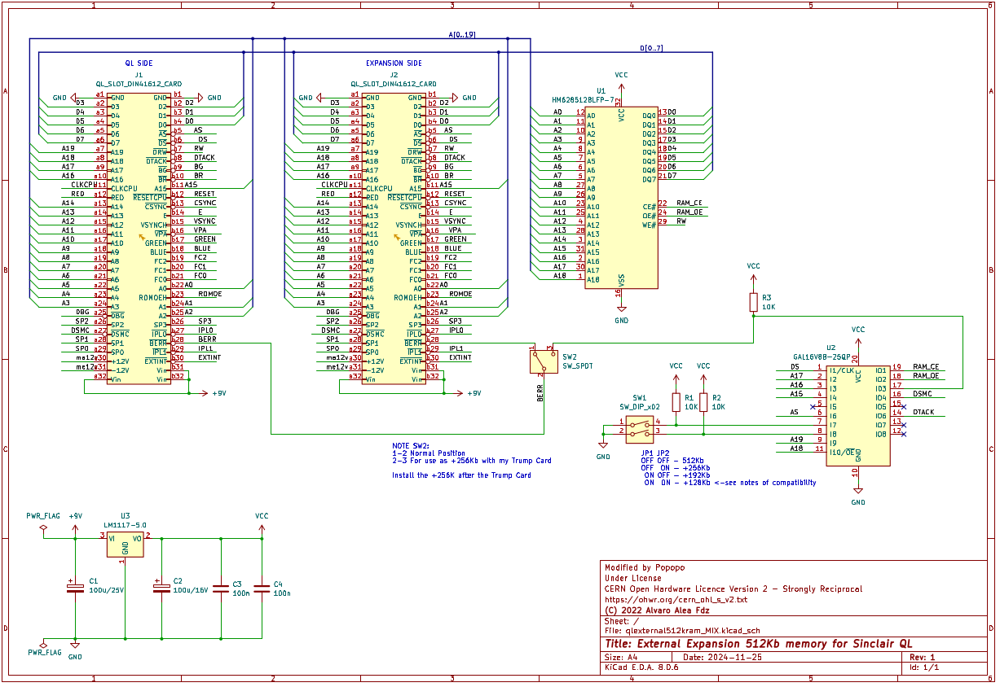
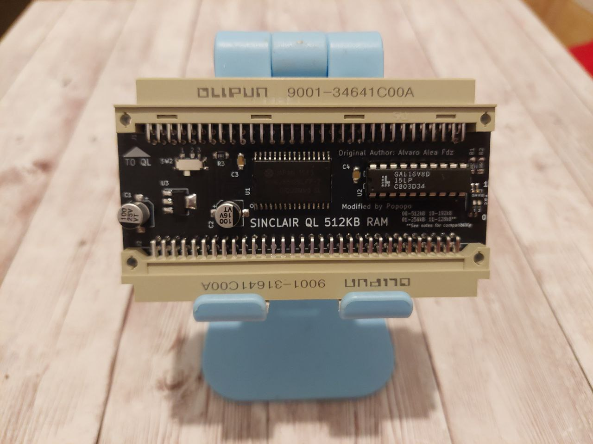
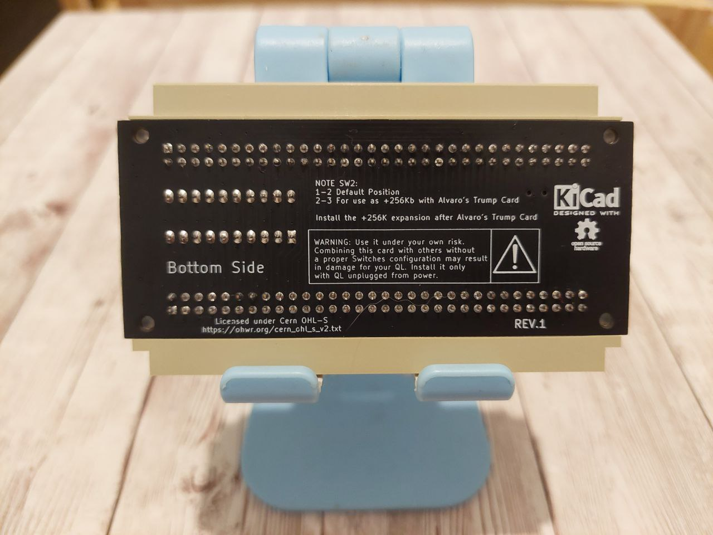
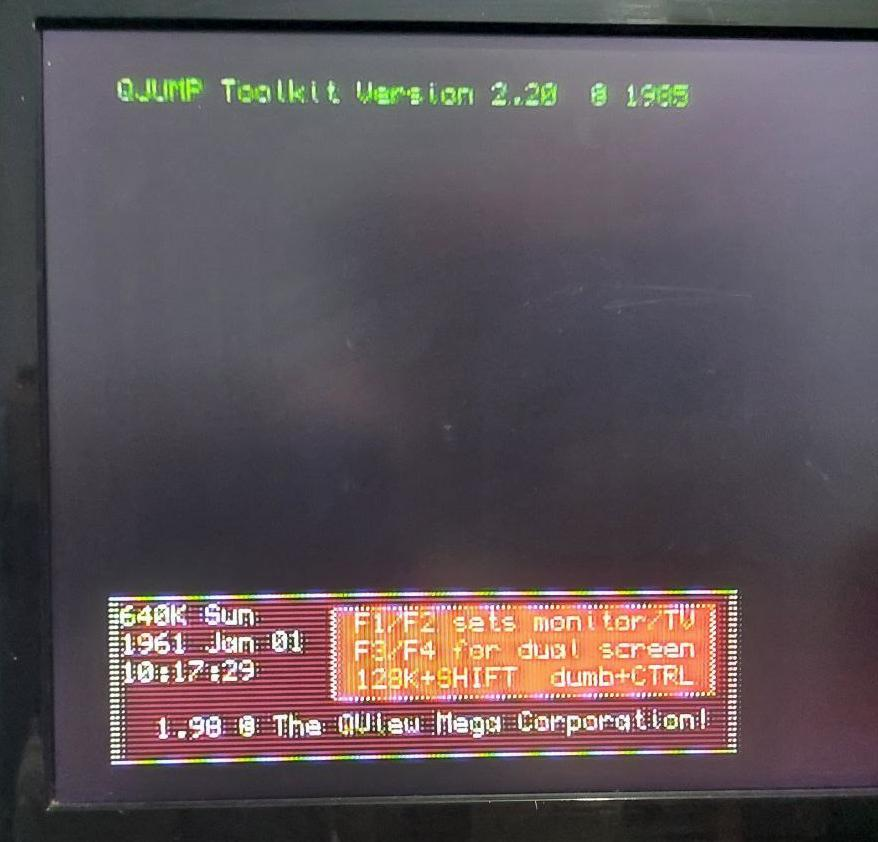
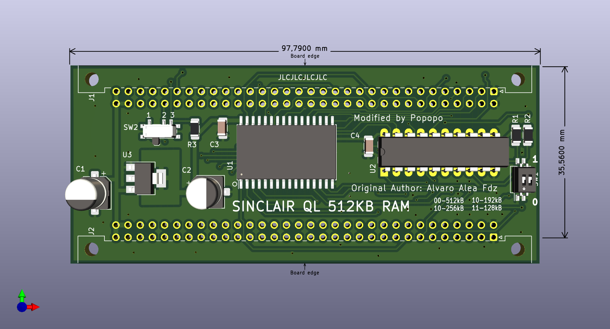
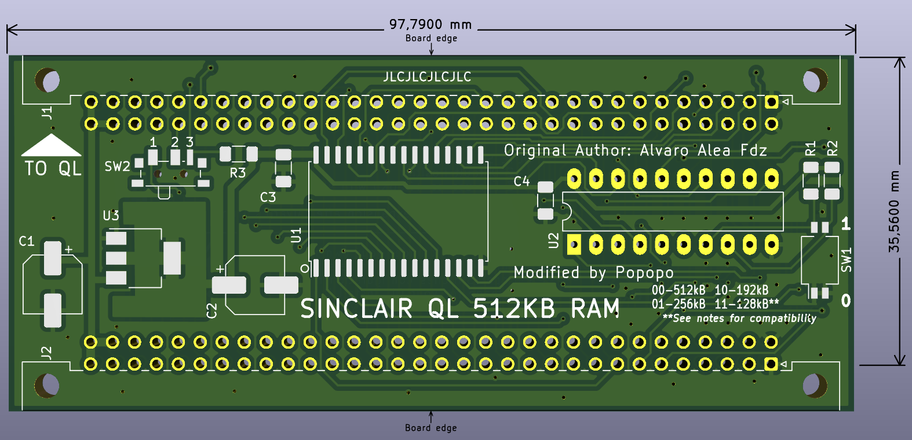
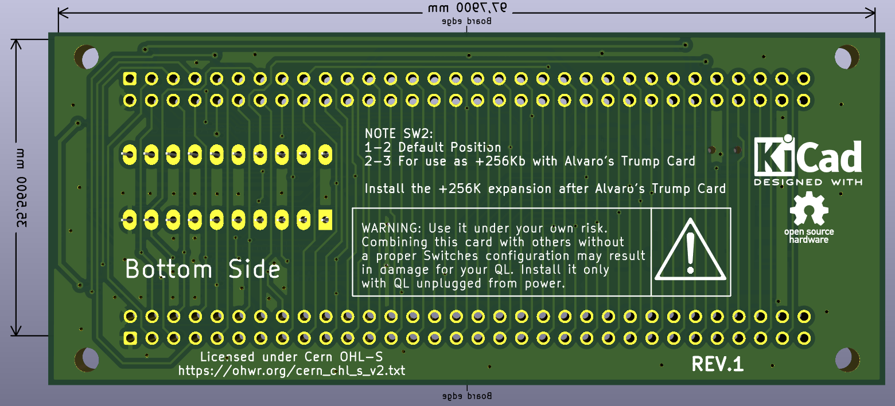
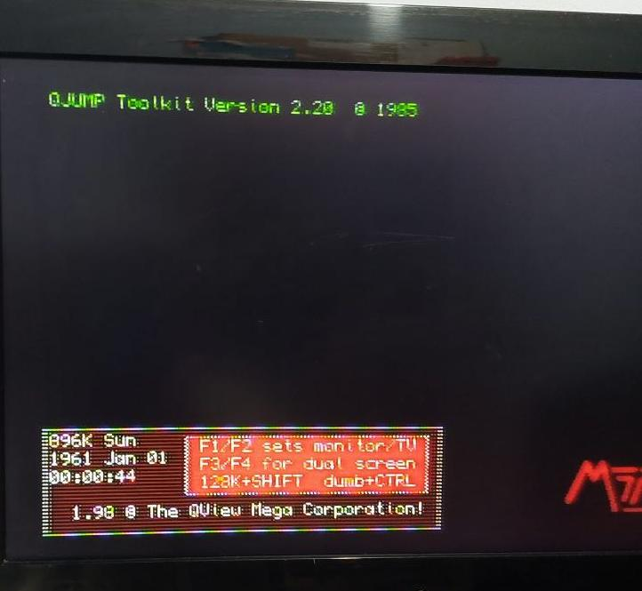
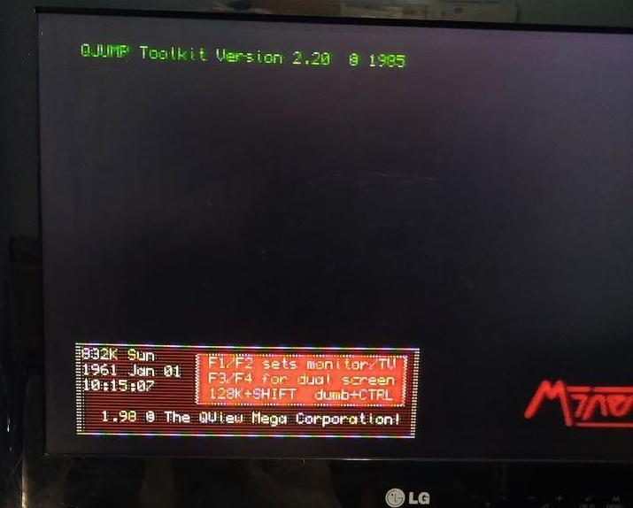

# SINCLAIR QL 512kB External Rom Expansion

**This board will provide up to 512kB aditional of static RAM (*fast-ram*) to the sinclair QL.**

## Introduction & Purpose

The projects merges from the need of a expansion board OpenHardware & OpenSource that could adds aditional RAM memory to a stock QL. It is widely covered by other similar projects like the one that was taking as base of this one.

Regardless there are some needs not covered and that this project aim to solve (*what have been achived*). The most important is that other projects can be combinend by advance users with electronic skills due to soldering requirements but not for final users. Also other solutions make difficult to use in/and with other hardware developments (*every address conflict may result in the must of rewiring and modifying boards to change address*).

So once got the need, there was a OpenHardware project that was a very good point to start and saved a lot of time. This project is also based in the works from other people who gives a lot of time and effort to the community. All of them are  [referenced on the credits](#Credits-&-License).

Finally, with the same spirit to give to the users another device to the community for free use, also something that would not be lost if the author cannot produce them (what is normal in a retro-tech area). Everyone could make their own board or to adquire from friends or sellers. 

**The only restrictions: the credits have to remain in the PCB and derivate projects.**

## Advantages of the memory expansion

For developments also it gives a special feature not pressent in other developments, it is that developers could play around with switches without need to solder and test them directly with their own hardware projects. Saving time and reducing the risk of damage for soldering, and continuos inserting/removing card actions.

Thanks to the use of switches it doesn't need any soldering skill at all. So final users can change it in combination with later devices (when it is possible) in an easy way. Just changing switchs setup.

Moreover also for electrical reasons the ground plane was increased, and in order to make easier the soldering process and repairing part of the components have change orientation an places.

Passtrough connector now go directly since they are not differential/balanced signals to extremes of the board. What means a reduction of the induction side effects. It also implies that the distances are shorter for signals what may result in more compatibilities attributes.

On the board you have extra information that is helpful for final users but also for developers.

Full documentation and wiki page under construction

---

---

 

 

---
**Boards work fine in the QL used for testing**

Two board can be stacked to got a maximun of 898Kb of Memory (*same as Miracle's Trump Card*).

> [!CAUTION]
> Be aware **you can not have 2 memory expansion in same area** (*Jose Leandro's QBide, Trump Card, etc*).

Provide a expansion conector to allow conect aditional interfaces.

There area available 4 configuration trough switches in the PCB.
* 00 => 512kB - This is the standar 512kB expansion for any QL
* 01 => 256kB - This is for use as a second expansion, use the full QL space for a maximun of 898kB, be aware that this is incompatible with a lot of expansion card, so use with caution (Any expansion card that do not use jumper/switch for configuration will be incompatible).
* 10 => 192kB - Similar to 256kB provide aditional space for expansion cards correctly configured.
* 11 => 128kB - Similar to 256kB provide aditional space for expansion cards correctly configured.

> [!IMPORTANT]
> Be aware that **the configuration of 128Kb can not be installed alone**.

For be able to use 128kB, for a total of 768kB, is mandatory to have an aditional expansion card that put ROM in address E00000h, in other case the QL ROM will hang indicating RAM malfunction, because a weired overlap of the internal 128kB with this external 128kB.

---

# How to get one

You may get one in two ways:

1. Make your own board PCB.
2. From another person that could sell it by any platform.
3. From me directly.

## Make your own expansion RAM
Firstly you will need the Gerbers for manufacturer. Check the Gerber File section.
Secondly the most complicate part is to get the components and solder them. The material cost would be around 10-25€ (without taxes, fees and extras for shipping from PCB manufactures and components). If you are reading it is because you are get used so no need to tell you what it means and problems with some distribuitors.

## Buying it to somebody
My advice & warning in case you cannot make your own board: buy it to someone trusful.

Some people may sell (*same happens with other OpenHardware projects*) giving no support, guarantee or responsability. So you could get it (in the worse case with credits removed) faulty or close to fail, without test them or futher support.

Other makers are trusful people well known in QL world and other scenes that you may trust. That should be the preference number 1 to find them in QL Forum (UK) and Facebook group or some platforms where you could check the reputation of the seller.

## Buy it directly to me
I'm not a shop but I'd love to help to everyone to have one. Also to make this nice development known and appreciated among old and new Sinclair QL users. Keeping this effort alive.

In case you want one from me, just find/write me directly by QL Forum, Facebook or Telegram ( @Lindyhop ) or email me to ( silverio1974.sr@gmail.com ). *The cost will be 35€ + shipping. I'm happy send to any country*. Note there must be an awaiting list.

* I test it before shipping in my own QL, that implies if there is a **fake/faulty** component (GAL are from China, no possible to get them in other way), the only **damage QL** due to faulty component will be mine, not yours.
* I mount it very cafefully and cleaning the board to avoid unpleasant surprises, trying keep the beauty, beautiful.
* Components (*but GAL what are discontinued*) are bought from trustful distribuitors (*Mouser, RS, JLC partner, etc*).
* You won't need to complain with distribuitors and be penalized with innecesary delayed time for components if something goes wrong with the seller (moreover when you buy to China).

# Gerber file

Gerbers ready to use. Labels are ready for ordering PCBs with JLCPCB but you can use your favourite maker or built it by yourself.

[Click here to download the Gerber](Gerber/Gerber_Popopo_QL_RAM_Expansion_v1a.zip) 

---

In the GAL folder there is the source code to be compiled with GALasm that you can found here: https://github.com/daveho/GALasm

## Mini Trump Card Compatibility

Alvaro Alea has done a version of the trump card disk interface here: https://github.com/alvaroalea/QL_MiniTrump3 , this interface do not provide memory like the original one. You can combine two of this card and the minitrump to got the same of the original trump card.

> [!IMPORTANT] You should conect the 512Kb Card to the QL, the MiniTrump Card to the 512Kb, and the +256Kb card to the Mini Trump, and in this board you need to change Switch (*SW1*) to 2-3 to allow the Minitrump card to coordinate with the second memory card.

 

 

## Combination with other cards
With other expansion card you could reach extra RAM. Next pictures shows the results.

> [!IMPORTANT] For it, it requires to set the switchs properly and be in the right place in the chain of expansion cards. *Some setting in other boards may be needed*.

## Precautions

Some precautions must be taken in order to prevent accidental damage in the system. The next are the most common and important recomendations.

* Do not connect it with the QL powered. Disconnect the QL Power cable before to connect it.
* Do not change the switchs position with the QL powered.
* Do not connect to a damaged QL, it may destroy de Ram Expansion board.
* Recomendation. before to combine with another expansion card, be sure they not share same address.
* Recomendation. Be aware about static danger that may result in damage of the board. Take precautions if needed.

# Disclamer
Use it under your own risk. I take not responsability for any damage in your system.
Read the information to avoid any accidental damage.

# Credits & License
Original project of (C) 2022 Alvaro Alea Fernandez, who based his development on the work of McLeod Ideafix, Jose Leandro, Zerover and tcat among others. 

Thanks to Alberto Benítez (Lince) for his support in improvements the signals.

License under: CERN Open Hardware Licence Version 2 - Strongly Reciprocal

https://ohwr.org/cern_ohl_s_v2.txt

